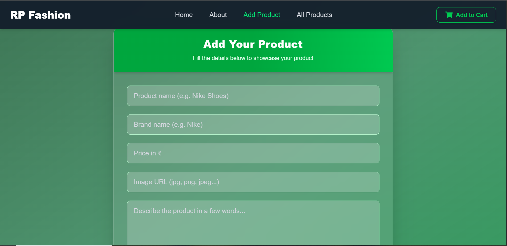
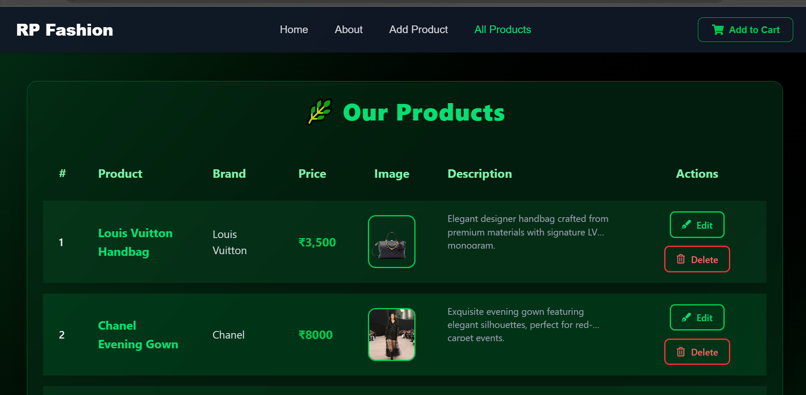

# RP Fashion E-Commerce Website

A modern, responsive e-commerce website built with React and TypeScript, featuring a sleek UI for browsing, adding, editing, and managing fashion products. This project uses JSON Server as a mock backend for CRUD operations.

## Features

- **Product Management**: View, add, edit, and delete fashion products
- **Responsive Design**: Optimized for desktop and mobile devices
- **Smooth Animations**: Powered by Framer Motion for enhanced user experience
- **Product Details Modal**: Interactive modal to view detailed product information
- **Toast Notifications**: User feedback for actions like adding or deleting products
- **Navigation**: Clean header with routing between pages
- **Footer**: Informational footer with links

## Tech Stack

- **Frontend**: React 19, TypeScript, Vite
- **Styling**: Tailwind CSS
- **Animations**: Framer Motion
- **Routing**: React Router v7
- **Backend**: JSON Server (mock API)
- **Icons**: React Icons
- **Notifications**: React Toastify

## Installation

1. Clone the repository:
   ```bash
   git clone <repository-url>
   cd website-with-json-server
   ```

2. Install dependencies:
   ```bash
   npm install
   ```

3. Start the JSON Server (mock backend):
   ```bash
   npx json-server --watch src/JSON/db.json --port 8000
   ```

4. In a new terminal, start the development server:
   ```bash
   npm run dev
   ```

5. Open your browser and navigate to `http://localhost:5173` (or the port shown in the terminal).

## Usage

- **Home Page**: Browse all fashion products with a grid layout and view details in a modal.
- **Add Product**: Navigate to `/addNewProduct` to add new fashion items.
- **Edit Product**: Click on a product to edit its details at `/edit-Product/:id`.
- **View All Products**: See all products at `/viewAllProduct`.
- **About**: Learn more about the website at `/about`.

## API Endpoints

The JSON Server provides the following endpoints:

- `GET /fashion` - Fetch all products
- `POST /fashion` - Add a new product
- `GET /fashion/:id` - Fetch a specific product by ID
- `PATCH /fashion/:id` - Update a product by ID
- `DELETE /fashion/:id` - Delete a product by ID

## Project Structure

```
src/
├── Components/
│   ├── Header/
│   │   └── Header.tsx
│   └── Footer/
│       └── Footer.tsx
├── Pages/
│   ├── Home/
│   │   └── HomePage.tsx
│   ├── About/
│   │   └── AboutPage.tsx
│   ├── AddProduct/
│   │   └── AddNewProduct.tsx
│   ├── EditProduct/
│   │   └── Editproduct.tsx
│   └── ViewProducts/
│       └── ViewAllProducts.tsx
├── Routes/
│   └── routes.ts
├── Service/
│   └── APIService.tsx
├── JSON/
│   └── db.json
├── App.css
├── App.tsx
├── index.css
└── main.tsx
```

## Screenshots




product.PNG

## Contributing

Contributions are welcome! Please fork the repository and submit a pull request.

## License

This project is licensed under the MIT License.
